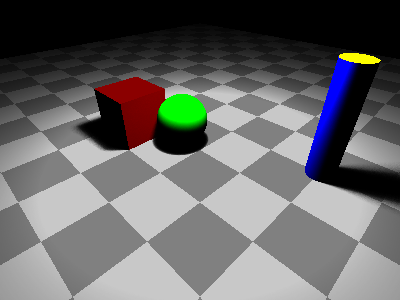

# rt

rt is a simple ray tracing project designed to build foundational understanding of rendering 3D scenes through ray tracing techniques. Below is the default scene rendered.



In this project, we implement:
- simple objects:
    - 2D plane
    - Cube
    - Cylinder
    - Sphere
- camera
- lights:
    - emission
- material:
    - lambertian
    - metal
    - dielectric
- Texture:
    - Solid Color
    - Checked Box
    - Gradient
    - Image

We explore the following concepts:
- The mathematical foundations of ray tracing
- How geometric shapes are defined and rendered in 3D space
- The role of light, material, and texture in producing realistic images

## Installation
This project is written entirely in Rust. To get started:
- Make sure Rust is installed.
- Clone the repository

## Usage
Running the project with:
`cargo run`
will render a default scene and save the output to a file named `output.ppm` in the current directory.

To render your own scene, you will have to define your scene in `main.rs` `fn main()`.
```rust
fn main() -> std::io::Result<()> {
    let mut scene = Scene::new();

    default_scene(&mut scene); // replace this with your scene setup
    scene.render("output.ppm")?; 

    Ok(())
}
```
Read about the [**basic types**](README_basic_types.md) that you will be working with.

Read about the [**scene elements**](README_scene_elements.md) and how to set them up.

## Flags
This project supports several command-line flags to customize rendering without modifying the source code.

Run your program with flags like this:
```rust
cargo run -- [FLAGS]
```

### Available Flags
| Flag | Description | Example |
|------|-------------|---------|
| `-i` | This will print the usage info | `-i` | 
| `-o <filename>` | Specify output filename instead of the default `output.ppm` | `-o result.ppm` |
| `-s <scene_num>` | Select which scene to render. Valid values: 1 to 4. Defaults to scene 4. | `-s 2` |
| `-r <width> <height>` | Set the resolution of the rendered image. Width and height must be positive integers. | `-r 800 600` |
| `-q <sample_rate>`| Specify the quality/sample rate of the image. This determines how many rays we shoot out per pixel to decide its color. |
| `-d <depth>`| Specify how many times each ray bounces |
| `-n <non_parallelized>`|  Disable parallelization (use single-threaded rendering, for testing without over-stressing cpu) |


#### Example Usage
Render scene 2 with resolution 800x600 and save output as `my_render.ppm`:
```rust
cargo run -- -s 2 -r 800 600 -q 128 -d 8 -n -o my_render.ppm
```

If you omit any flags, the program uses default values:
- Scene 3 is rendered
- Resolution is whatever is set in the scene (or default)
- Output is saved to `output.ppm`


### Project flow

This ray tracer follows a typical rendering pipeline from scene setup to final image output:

1. Scene Construction

- Objects (spheres, cubes, planes, cylinders) are added to the scene
- Lights are positioned for illumination
- Camera viewpoint and settings are configured
- Background and quality parameters are set

2. Ray generation
For each pixel in the output image:

- Camera generates multiple rays through the pixel (based on sample rate)
- Each ray has an origin (camera position) and direction (toward the pixel)

3. Ray-Scene intersection
for each ray:

- Ray is tested against every object in the scene
- The closest intersection is selected (what you actually see)
- If no intersection: return background color

3. Surface Properties Calculation
At each intersection point:

- Surface normal is computed (which way the surface faces)
- UV coordinates are calculated for texture mapping
- Material properties are retrieved (color, reflectance, etc.)

5. Light Calculation
- Shadow rays are cast from hit point to each light source
- Direct illumination is calculated using material properties
- Multiple lights contributions are summed together

6. Color Accumulation & Anti-aliasing

- Multiple sample rays per pixel are averaged for smooth edges
- Final pixel color is computed and stored

7. Image Output

- Rendered pixels are written to PPM format file
- Progress bar shows rendering completion status