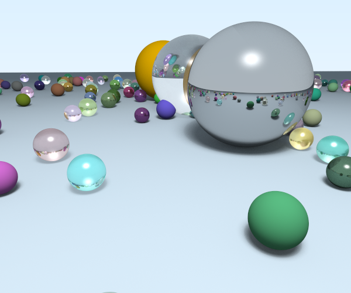

# rt

rt is a simple ray tracing project designed to build foundational understanding of rendering 3D scenes through ray tracing techniques.



In this project, we implement:
- Simple objects:
    - 2D plane
    - Cube
    - Cylinder
    - Sphere
- Camera
- Materials:
    - diffuse
    - reflective
    - refractive
    - dielectric
    - emission (light source)
- Textures:
    - Solid Color
    - Checked Box
    - Gradient
    - Image

We explore the following concepts:
- The mathematical foundations of ray tracing
- How geometric shapes are defined and rendered in 3D space
- The role of light, material, and texture in producing realistic images

## Installation
This project is written entirely in Rust. To get started:
- Make sure Rust is installed.
```bash
git clone https://github.com/AllenLeeyn/rt_2.git
cd rt_2
```

## Usage
Running the project with:
`cargo run`
will render a default scene and save the output to a file named `output.ppm` in the current directory.

**Performance Tip:** For significantly faster rendering, use the release build with:
`cargo run --release`
This enables Rust's optimizations and can provide very significant (roughly 2-10x) speed improvements for the ray tracing workloads.

To render your own scene, you will have to define your scene in `main.rs` `fn main()`.
```rust
fn main() -> std::io::Result<()> {
    let mut scene = Scene::new();

    default_scene(&mut scene); // replace this with your scene setup
    scene.render("output.ppm")?; 

    Ok(())
}
```
## Example scene
```rust
fn scene_one(scene: &mut Scene) {
    scene.set_background(Texture::Gradient(Color::WHITE, Color::LIGHT_BLUE, PI));

    scene.camera_mut().set(
        Point3::splat(4.0),
        Vec3::ZERO,
        Vec3::Y,
        60.0,
        1.0,
        (400, 300),
    );

    scene.add_object(Sphere::new(
        Point3::ZERO,
        2.0,
        Material {
            texture: Texture::SolidColor(Color::PASTEL_LIME),
            diffuse: 1.0,
            reflectivity: 0.0,
            transparency: 0.0,
            index_of_refraction: 0.0,
            emission: None,
        },
    ));

    scene.add_object(Sphere::new(
        Point3::new(0.0, 5.0, 4.0),
        1.0,
        Material {
            texture: Texture::SolidColor(Color::WHITE),
            diffuse: 0.0,
            reflectivity: 0.0,
            transparency: 0.0,
            index_of_refraction: 0.0,
            emission: Some(Color::WHITE * 10.0),
        },
    ));
}
```

### Moving the camera

The camera is controlled using the `camera_mut().set()` method with 6 parameters:

```rust
fn scene_three(scene: &mut Scene) {
    scene.camera_mut().set(
        Point3::new(0.0, 2.0, 4.0), // 1. Camera position (where camera is)
        Vec3::new(0.0, 1.5, 0.0),   // 2. Look-at target (where camera points)
        Vec3::Y,                    // 3. Up vector (camera orientation)
        60.0,                       // 4. Field of view (zoom level)
        1.0,                        // 5. Aspect ratio (width/height)
        (400, 300),                 // 6. Resolution (image size)
    );
}
```

### Controlling Brightness and Lightning
Control scene brightness by adjusting light emission values:

```rust
// Dim light
scene.add_object(Sphere::new(
    Point3::new(0.0, 5.0, 0.0),
    1.0,
    Material {
        texture: Texture::SolidColor(Color::WHITE),
        diffuse: 0.0,
        reflectivity: 0.0,
        transparency: 0.0,
        index_of_refraction: 0.0,
        emission: Some(Color::WHITE * 2.0),  // Low brightness
    },
));

// Medium brightness
emission: Some(Color::WHITE * 10.0),  // Medium brightness

// Very bright light
emission: Some(Color::WHITE * 20.0),  // High brightness
```


Read about the [**basic types**](README_basic_types.md) that you will be working with.

Read about the [**scene elements**](README_scene_elements.md) and how to set them up.

## Flags
This project supports several command-line flags to customize rendering without modifying the source code.

Run your program with flags like this:
```rust
cargo run -- [FLAGS]
```

### Available Flags
| Flag | Description | Example |
|------|-------------|---------|
| `-i` | This will print the usage info | `-i` | 
| `-o <filename>` | Specify output filename instead of the default `output.ppm` | `-o result.ppm` |
| `-s <scene_num>` | Select which scene to render. Valid values: 1 to 4. Defaults to scene 4. | `-s 2` |
| `-r <width> <height>` | Set the resolution of the rendered image. Width and height must be positive integers. | `-r 800 600` |
| `-q <sample_rate>`| Specify the quality/sample rate of the image. This determines how many rays we shoot out per pixel to decide its color. | `-q 128` |
| `-d <depth>`| Specify the maximum times each ray bounces | `-d 8` |
| `-n <non_parallelized>`|  Disable parallelization (use single-threaded rendering, for testing without over-stressing cpu) | `-n` |


#### Example Usage
Render scene 2 with resolution 800x600 and save output as `my_render.ppm`:
```rust
cargo run -- -s 2 -r 800 600 -q 128 -d 8 -n -o my_render.ppm
```

If you omit any flags, the program uses default values:
- Scene 3 is rendered
- Resolution is whatever is set in the scene (or default)
- Output is saved to `output.ppm`


### Project flow

This ray tracer follows a typical rendering pipeline from scene setup to final image output:

1. Scene Construction

- Camera viewpoint and settings are configured
- Objects (spheres, cubes, planes, cylinders) are added to the scene
- Lights are positioned for illumination (emissive materials act as light sources)
- Background and quality parameters are set

2. Ray generation
For each pixel in the output image:

- Camera generates multiple rays through the pixel (based on sample rate, can be set using the -q flag)
- Each ray has an origin (camera position) and direction (toward the pixel)
- Very small random jitter is added to ray direction for anti-aliasing

3. Ray-Scene intersection
For each ray:

- We check the ray against every object in the scene, finding which ones it intersects with
- The closest intersection is selected (within a reasonable distance limit, defaults to 50)
- If no intersection: return background color

4. Surface Properties Calculation
At each selected intersection point:

- Surface normal is computed (which way the surface faces)
- u and v (texture coordinates) are calculated for texture mapping
- Material properties are retrieved (texture/color, reflectivity, transparency, etc.)
- Front/back face determination for proper lighting and refraction

5. Material Scattering & Ray Bouncing
For each intersection with a material:

- Material properties (diffuse, reflectivity, transparency, index of refraction) are configured per object in the scene
- Scattering type is probabilistically selected based on material property weights:
  - Higher diffuse values increase likelihood of diffuse scattering
  - Higher reflectivity values increase likelihood of reflection
  - Higher transparency values increase likelihood of refraction
- New scattered ray is generated based on selected scattering type:
  - **Diffuse**: Random direction in hemisphere around surface normal
  - **Reflection**: Mirrored direction with optional fuzziness
  - **Refraction**: Snell's law with Fresnel reflection fallback
- Ray attenuation (color filtering) is applied based on material texture and transparency
- Process repeats recursively up to maximum depth (set by -d flag)

6. Light Emission & Accumulation

- Emissive materials contribute their emission color directly
- Scattered ray colors are accumulated with proper attenuation
- Multiple sample rays per pixel are averaged for smooth edges (anti-aliasing)
- Final pixel color is computed and stored

7. Parallel Processing

- Rendering can be parallelized across image rows (enabled by default)
- Single-threaded mode available for testing (use -n flag)
- Progress tracking shows rendering completion status

8. Image Output

- Rendered pixels are written to PPM format file
- Progress bar shows rendering completion status

### Scene Descriptions

- Scene 1 - Simple sphere with area lighting
- Scene 2 - Textured cube on checkerboard plane
- Scene 3 - The four basic objects with different textures and a light
- Scene 4 - Same as scene 3 from a different angle
- Scene 5 - Cornell Box with mixed materials and glass sphere
- Scene 6 - Complex scene with particle system and multiple glass objects
- Scene 7 - Recreation of example render from assignment
