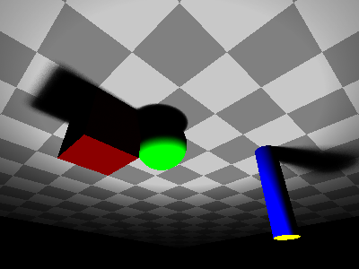
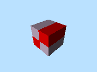
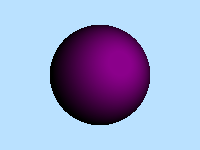

# Scene Elements
The scene consists of:
- [Camera](#camera)
- [Background](#background)
- [Objects](#objects)
- [Lights](#lights)

Read about the [**basic types**](README_basic_types.md) (Vec3, Point3, Color, Texture) that you will be need to define for the scene elements.

## **Camera**
The camera defines the viewer's perspective—essentially acting as a window into the 3D scene.

To update camera settings (poisition, direction, orientation, fov), you can use `Scene.camera_mut().set`
```rust
    scene.camera_mut().set(
        origin: Vec3            // Camera position
        look_at: Vec3,          // Look at position
        vup: Vec3,              // controls camera orientation
        vfov: f32,              // field of vision
        focal_length: f32,      // focal length
        resolution: (u32, u32)  // resolution
    );
```

Example:
```rust
    // we modify the default scene camera
    scene.camera_mut().set(
        Vec3::new(-3.0, 3.0, -3.0), // put the camera on the opposite side
        Vec3::ZERO,
        -Point3::Y,                 // orientate the camera downwards
        60.0,
        1.0,
        (400, 300)
    );
```
With this, we create something like a mirror image of the default image.



## **Background**
You can set the bckground with the different `Texture`types.
```rust
    scene.set_background(Texture::SolidColor(Color::BLACK));
```
The default background is just black. You can use any of the `Texture`type for the background.
```rust
    scene.set_background(
        Texture::Gradient(
            Color::BLUE,
            Color::CYAN,
            std::f32::consts::FRAC_PI_2));
```


## **Objects**
The program supports four basic object types:
- 2D plane
- Cube
- Cylinder
- Sphere

### Adding objects
To add an object to the scene, you can use:
```rust
    scene.add_object(Object)
```
Example:
```rust
    scene.add_object(Plane::new(
        Point3::ZERO,
        Vec3::new(20.0, 0.0, 20.0),
        Texture::Checkerboard(Color::GRAY, Color::PASTEL_GRAY, 20.0),
    ));
```

### 2D plane
A flat surface aligned with the X and Z axes.
```rust
    Plane::new(
        center: Point3,   // Center position of the plane
        size: Vec3,       // Size vector defining width (X), height (Y), and depth (Z)
        texture: Texture, // Texture applied to the plane surface
    );
```


### Cube
A six-sided box defined by its center and uniform side length.
```rust
    Cube::new(
        center: Point3,   // Center position of the cube
        size: f32,        // Length of each edge (all sides are equal)
        texture: Texture, // Texture applied to the cube surfaces
    );
```


### Cylinder
A vertical cylinder defined by its base center, radius, and height.
```rust
    Cylinder::new(
        base_center: Point3, // Center of the bottom circular face
        radius: f32,         // Radius of the cylinder's circular base
        height: f32,         // Height of the cylinder
        texture: Texture,    // Texture applied to the cylinder surface
    );
```


### Sphere
A perfectly round 3D object defined by its center and radius.
```rust
    Sphere::new(
        center: Point3,   // Center position of the sphere
        radius: f32,      // Radius of the sphere (distance from center to surface)
        texture: Texture, // Texture applied to the sphere surface
    );
```


## **Lights**
Lighting is essential for bringing realism and depth to your ray-traced scene. You can add different types of lights—point lights and directional lights—to simulate various lighting conditions.

Multiple lights can be added to a scene to create more complex lighting.

### Adding a light
To add a light to the scene, use:
```rust
scene.add_light(Light)
```

Example:
```rust
scene.add_light(Light::new_point(
    Point3::new(0.0, 4.0, 0.0), // Light position
    Color::WHITE,               // Light color
    30.0,                      // Intensity
    512,                       // Shadow samples for soft shadows
    0.6,                       // Radius of the light source
    50.0                       // Softness of shadows
));
```

### Point light
A point light emits light in all directions from a single point in space. It can simulate lamps, candles, or glowing objects with configurable softness and shadow sampling.
```rust
    Light::new_point(
        position: Point3,   // position
        color: Color,       // color
        intensity: f32,     // intensity
        samples: usize,     // number of soft shadow samples
        radius: f32,        // radius (for area light)
        softness: f32,      // softness factor
    )
``` 
The samples, radius, and softness parameters control how soft or sharp the shadows appear.

### Directional Light
A directional light simulates a distant light source like the sun, shining uniformly in one direction. It produces hard shadows and does not use samples, radius, or softness.
```rust
    Light::new_directional(
        direction: Vec3,    // direction
        color: Color,       // color
        intensty: f32,      // intensity
    )
```
Directional lights emit parallel rays from an infinite distance, ideal for simulating sunlight or moonlight.